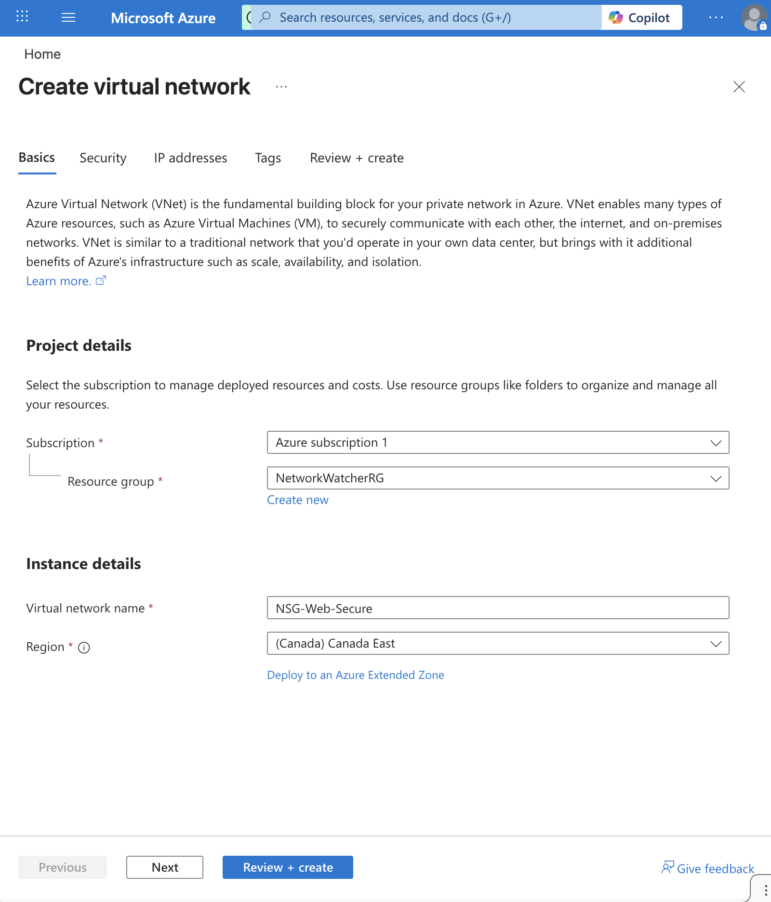
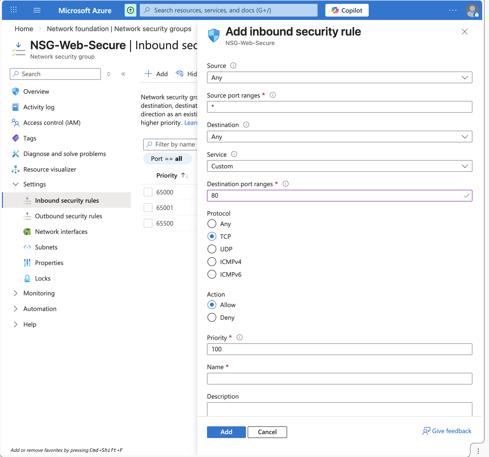
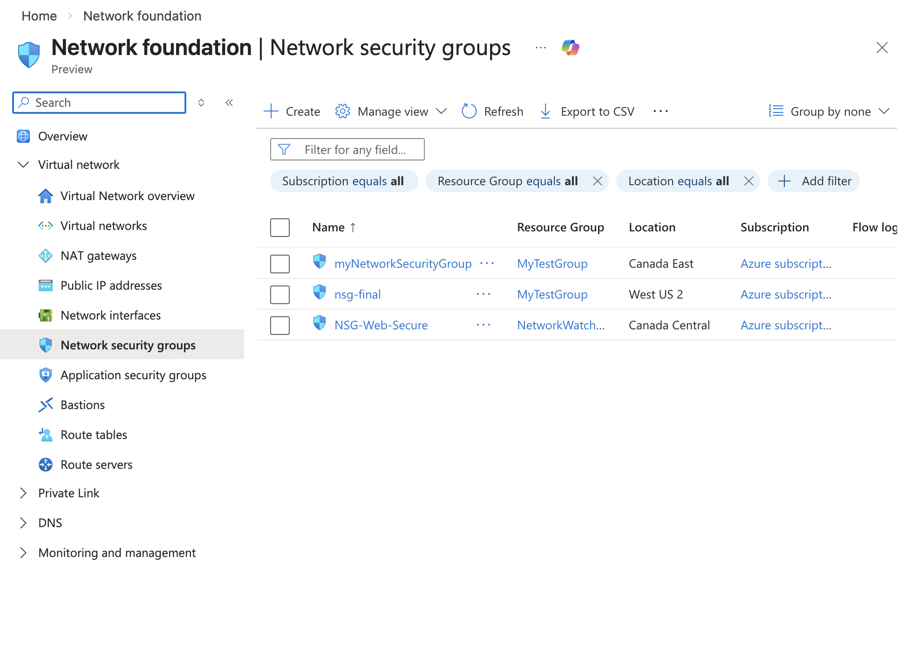
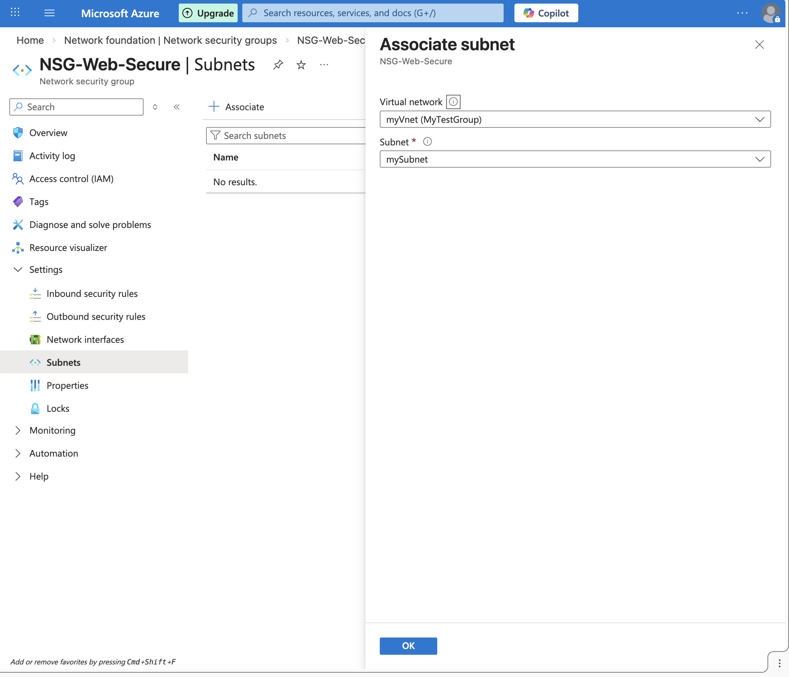

# Azure-NSG-VNet-Automation-Project

## Introduction
As an **IT & Project Coordinator**, I designed this project to demonstrate secure infrastructure deployment in Azure. This project focuses on **Virtual Networking** and **Traffic Filtering** to protect cloud resources.

## Technical Tasks
- **Virtual Network (VNet)**: Created `VNet-Production-Toronto` to host cloud assets.
- 
- **Network Security Group (NSG)**: Deployed `NSG-Web-Secure` as a stateful firewall.
- 
- **Security Rule Governance**: Configured Inbound rules to allow standard web traffic (Port 80) while maintaining a high security posture.
- **Network Association**: Successfully linked security policies to the production subnets.
- ### Challenges & Troubleshooting
- **Issue**: NSG and VNet region mismatch.
- 
- **Resolution**: I identified that the Network Security Group was in **Canada East** while the VNet was in a different region. I re-deployed the VNet to match the NSG's region to enable successful association.
- **Verification**: Confirmed the association by linking `NSG-Web-Secure` to `mySubnet`.
- 

